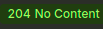

# API чатов и сообщений

REST API для управления чатами и сообщениями, созданный с использованием Go.

#### 1. Скопируйте репозиторий:
```bash
git clone https://github.com/gipnozhard/go-chat-app.git
cd go-chat-app
```

API будет доступно по адресу: http://localhost:8080

#### Локальный запуск

Установите Go 1.25+ и PostgreSQL

####  Создайте базу данных:

```sql
CREATE DATABASE chat_db;
CREATE USER chat_user WITH PASSWORD 'chat_password';
GRANT ALL PRIVILEGES ON DATABASE chat_db TO chat_user;
```

Для Postgres использовать свой userName и пароль.

## Запуск приложение в терминале:

```bash
make build    # Создание образов Docker"
make run      # Запуск приложения"
make clean    # Остановка и удаление контейнеры"
```

## API Endpoints:

#### 1.Создать чат
```
POST http://localhost:8080/chats
Content-Type: application/json

{
  "title": "Название чата"
}
```

Ограничения:

* Title не может быть пустым

* Максимальная длина: 200 символов

* Пробелы по краям автоматически обрезаются
-------------------------------------------
#### 2.Отправить сообщение
```
POST http://localhost:8080/chats/{id}/messages/
Content-Type: application/json

{
  "text": "Текст сообщения"
}
```

Ограничения:

* Чат должен существовать (иначе 404)

* Text не может быть пустым

* Максимальная длина: 5000 символов

* Пробелы по краям автоматически обрезаются
-----------------------------------------
#### 3.Получить чат с сообщениями
```
GET http://localhost:8080/chats/{id}?limit=20
```

Параметры:

* limit - количество последних сообщений (по умолчанию 20, максимум 100)

Пример ответа:
```
{
    "chat": {
        "id": 2,
        "title": "Название two",
        "created_at": "2026-01-23T19:06:12.033947Z"
    },
    "messages": [
        {
            "id": 1,
            "chat_id": 2,
            "text": "для второго чата сообщение",
            "created_at": "2026-01-23T19:06:40.95161Z"
        },
        {
            "id": 2,
            "chat_id": 2,
            "text": "tot cjj,otybt lkz 2 сообщение",
            "created_at": "2026-01-23T19:07:01.827501Z"
        }
    ]
}
```

------------------------------------------
#### 4.Удалить чат
```
DELETE http://localhost:8080/chats/{id}
```

Ответ:



`Важно`: При удалении чата все его сообщения удаляются автоматически (каскадное удаление).

-------------------------------------------

### Тестирование:
```bash
# Запустить все тесты
make test
```

### Структура проекта

```
.
├── cmd
│   └── main.go
├── docker-compose.yml
├── Dockerfile
├── go.mod
├── go.sum
├── img.png
├── internal
│   ├── config
│   │   └── config.go
│   ├── db
│   │   ├── postgres
│   │   │   ├── connection.go
│   │   │   └── migrate.go
│   │   └── service
│   │       └── chat_service.go
│   ├── handler
│   │   ├── chat_handler.go
│   │   └── chat_handler_test.go
│   ├── models
│   │   ├── chat.go
│   │   └── message.go
│   ├── repository
│   │   ├── chat_repository.go
│   │   └── message_repository.go
│   └── server
│       └── router.go
├── Makefile
├── migrations
│   └── 001_create_tables.sql
└── README.md

12 directories, 20 files
```

### Технологии:

* Go 1.25+ - основной язык

* PostgreSQL - база данных

* GORM - ORM для работы с БД

* Goose - миграции базы данных

* net/http - стандартная HTTP библиотека Go

* Docker - контейнеризация